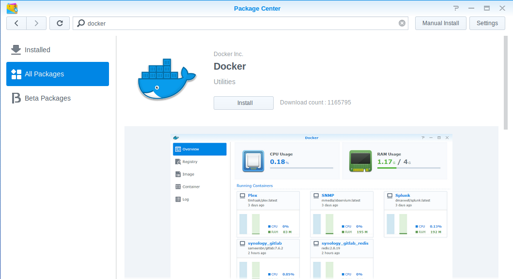
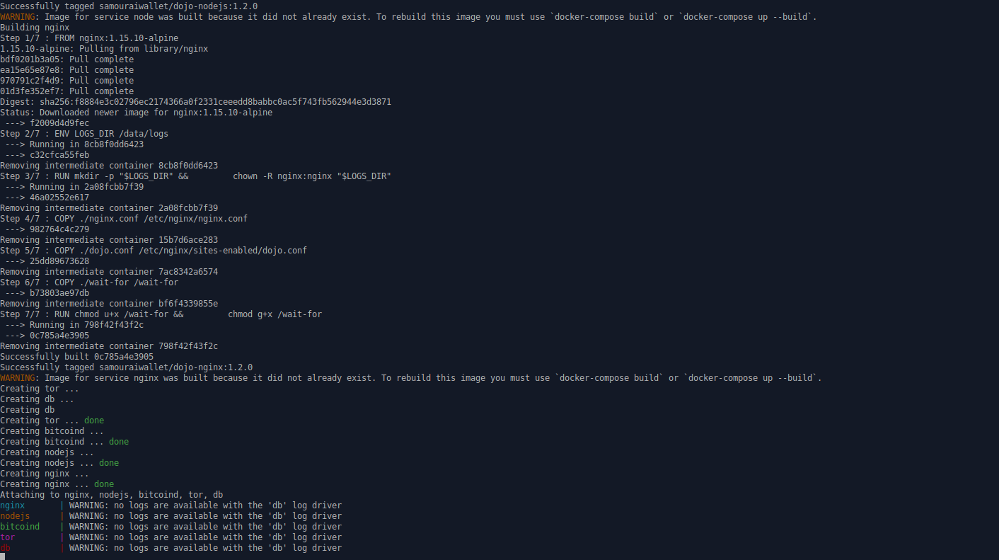

# Installation of Dojo on Synology

This will install Dojo on your Synology hardware.


## Table of Content ##
- [Requirements](#requirements)
- [Install procedure](#install)


<a name="requirements"/>

## Requirements ##

* Synology hardware connected 24/7 to internet
* Disk: 500GB (minimal) / 1TB (recommended)
* RAM: 4GB (minimal)

<a name="install"/>

## Install

- Connect to Synology web ui as administrator
- Open `Package center`, search for `Docker`, click `Install`.

- Open SSH terminal to your Synology
- Follow `first-time install procedure` in [DOCKER_setup.md](DOCKER_setup.md#install), but skip the first two steps:
```
  * Install Docker and Docker Compose on the host machine and check that your installation is working.
  * Install Tor Browser on the host machine.
```
You can use `/volume1/dojo` as `<dojo_dir>`.
- Install will complete with the following warnings, which you can safely ignore:
```
Attaching to nginx, nodejs, bitcoind, tor, db
nginx       | WARNING: no logs are available with the 'db' log driver
nodejs      | WARNING: no logs are available with the 'db' log driver
bitcoind    | WARNING: no logs are available with the 'db' log driver
tor         | WARNING: no logs are available with the 'db' log driver
db          | WARNING: no logs are available with the 'db' log driver
```


## Dojo status & logs
- Connect to Synology web ui as administrator
- Open `Docker`, then `Container`.
  

- You will see the following containers running:
  * bitcoind
  * db
  * nginx
  * nodejs
  * tor
- Select a container (ie `bitcoind`), click `Detail`, `Log` to see container's logs in real time

## Usage
- Retrieve the Tor onion addresses (v3) of the API and block explorer of your Dojo
```
./dojo.sh onion
```
Use Tor Browser for:
- Explorer: <explorer-onion-address>.onion (username=any, password=<EXPLORER_KEY>)
- Maintenance tool: <api-onion-address>.onion/admin (password=<NODE_ADMIN_KEY>)

## Upgrade
- Open SSH terminal to your Synology
- Stop Dojo
```
cd <dojo_dir>
./docker/my-dojo/dojo.sh stop
```
- Backup
```
cp -r ./ ../dojo-backup
```
- Download latest Dojo from [GitHub releases](https://github.com/Samourai-Wallet/samourai-dojo/releases)
```
  mkdir newDojo
  cd newDojo
  wget https://github.com/Samourai-Wallet/samourai-dojo/archive/v1.5.0.tar.gz
  tar xzvf v1.5.0.tar.gz
  cp -r samourai-dojo-1.5.0/* ../
  cd ..
```
- Upgrade
```
  ./docker/my-dojo/dojo.sh upgrade
```
- Clean
```
  rm -Rf newDojo
```
